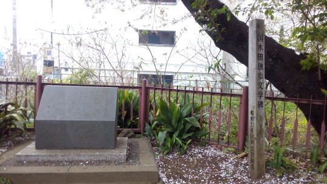
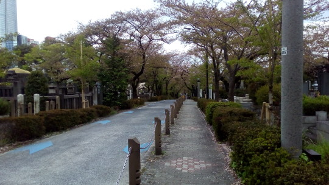
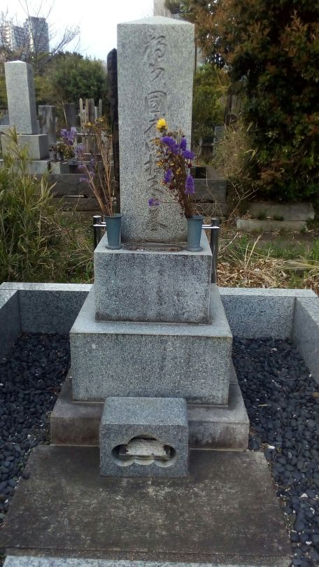
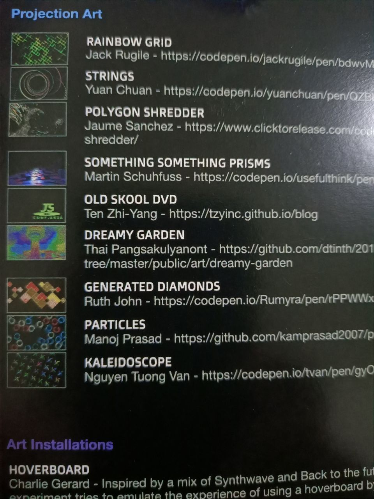
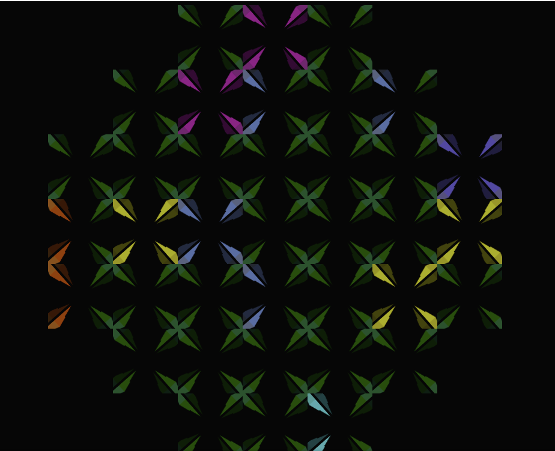
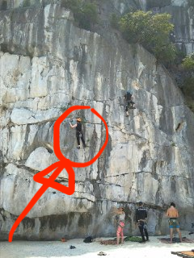
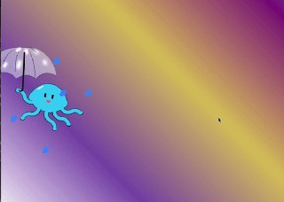

There used to be a list of things i wanted to do before turning 25 aka in 2019.

i don't need to take another glance at the list to say that i didn't achieve most of them.

However, that is not necessarily a bad thing.

What it means is that i realised that most of the things i wanted to do before didn't matter that much in the timeline given.

Just to name a few, things like seeing snow for the first time - actually it does matter to me, i do want to see snow - but it does not have to be now. i can always arrange a short trip to Japan in February and come back if all i wanted to see was just snow. In exchange, i saw the frost near the top of Mt. Kinabalu as i gritted my teeth against the cold wind on my bare face in the pitch black night.

Or, seeing the aurora - again, it does not have to be now. In exchange, i got to see the sunrise at the top of Mt. Fuji with a cold green tea bag in my hands alongside my climbing buddies.

Besides the things i didn't achieve before 25 however, i did unintentionally achieve one thing i planned for my 27th year instead: Learning a new (human) language. Let's go there when it's its turn.

They (whoever it is) say to start the new year we should talk about positive things first. So i will start with things that i have "achieved" within the span of last year.

##1. I. WENT. TO. JAPAN. OH. MY. GOSH (April 2019)
Let me just clarify first by saying the only countries i had been to before 2019 besides Vietnam and Singapore are Malaysia and Cambodia. So when i saw an excuse to get my otaku ass out of my otaku head and fly to the otaku land, i chomped at it as if it was a giant Subway sandwich.
Except, the first 2 things i went to visit the moment i landed, was, two literature monuments and a grave, all of the same man. Please don't ask me why.


Small cherry petals dotted the monument. It was beautiful.




My housemate jumped when i sent a selfie with the cemetery in the background. Don't worry i won't show my face here. Let the beauty of the cemetery not be tainted.

##2.  First tech conference: Realising the beauty of attending one as a female - no toilet queue (April 2019)
So as i mentioned, the whole excuse for me to visit Japan was Google's AMP conference.
i only have very limited experience working with AMP in the past as an intern when the technology was just about 1 year old, so it was a very nice refresher on the topic and a good way to enjoy other people's ideas all over the world (plus the good weather, good view and the good food. Oh, not to forget i had the chance to sneak out on a climb in Tokyo, too). Knowing myself to be the hands on type, i am convinced that if i were to ever watch a conference, i should just try to go there physically because i am not disciplined enough to remember to watch all the saved videos i have of important conferences.

##3. More rigorous volunteering with Project X (first half of 2019)
i made a point to attend a physical outreach with Project X at first almost weekly, and subsequently bi-weekly. Also, i got to attend their various workshops such as Counselling and Mental Health trainings!


##4. Second tech conference: Oh look it's my "art"! (June 2019)

As you can see some people submitted art to the conference and got free tickets! My submission is the last one on the list.
So the whole conference attending business actually starts from a Super Silly Hackathon session in December 2018, and at the end of the presentations, the organisers of JSConf.Asia 2019 invites artsy people to submit Javascript animations to their home website as a chance to get the conference ticket for free. Long story short, i did! And this is my "art" - to be honest, after longggg considerations of different things to make. i had fun selecting the colours for the crystals - my sense of colour and ratio is not very good.


See [my Codpen](https://codepen.io/SmokinClove/pen/gyOJKm) for animation.
This event was the first time anything visual i made got shown to people publicly.


##5. First tech meetup as a speaker: Fear Of Being Boring (July 2019)
i liked drawing as a child. As i grew up, i developed a tendency towards music. For a living, i code. So, why not do something that has part my inner child, part my adult sides in it?
In my university days, i always sneaked music aspects into the tasks that i do. Being it school projects, or joining a composing CCA, or taking up a second major in music production. i love the feeling of coding with the aim of something crazy in mind, something i enjoy like a child.
i decided to start drawing with pure HTML and CSS from the very simple to the much more complicated. And this [talk](https://www.youtube.com/watch?v=j7bx3CTkq-E) is the first step towards pursuing that hobby.


##6. Get Out!! : Fuji and Cat Ba (August 2019)

Oh yeah that's me.

First outdoor climbing trip (if i do not count the small climbing section within the Kinabalu trip, that is) ended up in Vietnam... Well the air ticket is affordable and there are nice islands out there so why not. The sea is literally behind you so you can do a climb and then jump in for a swim.

Once again stepping onto Japan's soil, i joined my climbing pals to conquer the beautiful Mt. Fuji (no photos sadly). Before you reach the top there is a torii gate that you need to pass through, seems like a sign of good luck, which i found quite interesting.

Anyway these trips were not just to make me feel more satisfied, it was also the last chances to get some fun before i enrolled in the part time Master's program.

##7. Break the 50 books a year barrier (September 2019)
Finished about (not all of the books are of typical thickness and sometimes i also insert short stories) 50 books, which started off as a list and then the list expanded infinitely but no problem my goal was to see if i could reach that number or not.

##8. First Hacktoberfest: As a participant and a "host" (October 2019)
i had a writeup about it here https://dev.to/smokinclove/my-first-hacktoberfest-from-contributing-to-receiving-contributions-2h7k

##9. Second public tech talk: Dancing with React Hooks (October 2019)
[This one](https://youtu.be/azkWujdvmVs) was especially fun, both to prepare and to execute. Reason being, i got to draw something hilarious and talk about it in a hilarious manner and still use it to talk about something popular. Also, how many chances do you get in your lifetime to (try to) moon walk in front of a group of serious looking adults including your own bosses? Even better, with no shoes! (There is a good reason for it, though)


##10. Finally got myself certified as a climber (November 2019)
i am only 1 year and 3 months late. No problem.

##11. Last tech (or not) talk of the year: "I wonder if jellyfish dream in their sleep"? (December 2019)

About learning in public and how lost i currently am in terms of inspirations for the next stage... Honestly with my Master's and all, i actually expected myself to have a hiatus from CSS drawing, though it's really disheartening to have to stop the flow... But right now i think i have a rough idea of what i want to make after coming back to it.

You can watch the talk [here](https://youtu.be/zJJcVuaEO3A)

##11. Finally a third language: Passing my JLPT N4 (December 2019)
So the goal that is supposed to be fulfilled before my 27th birthday but got fulfilled by my 25th year instead (well, the exam was in December so technically it is when i was 25 years and 1 month old) is to learn a new language. i started learning Japanese out of nowhere in February 2018 (so now is just nice 2 years ever since) after watching a certain anime named No.6. i strongly recommend it.

##13. Barely passing my Master program modules in the first semester: ```¯\_(ツ)_/¯``` well, uhm, it is what it is...


<em>However there are certainly a few things i needed to sacrifice in pursuit of new things.</em>

For one, i didn't get to volunteer as much as i could. The key thing about volunteering is consistency, so a lot of months had to be put in to build the rapport before any substantial change can be achieved. Though luckily, in both of the organisations i am still mainly involved in, i managed to reach a point of rapport first before taking a break due to my second duty as a student.

Secondly, i wish i could take more time to write journals. As easy as it is to be swept by the flow and hassle from one task to another, writing down our thoughts help us be more aware of of emotional states.

Now, my first task to complete before end of February 2020, is to finish [this damn book](https://markmanson.net/not-giving-a-fuck). It's important, very, very, important.

Til then, goodbye~ (:]ミ（:]彡（:]ミ（:]彡

Cheerio!