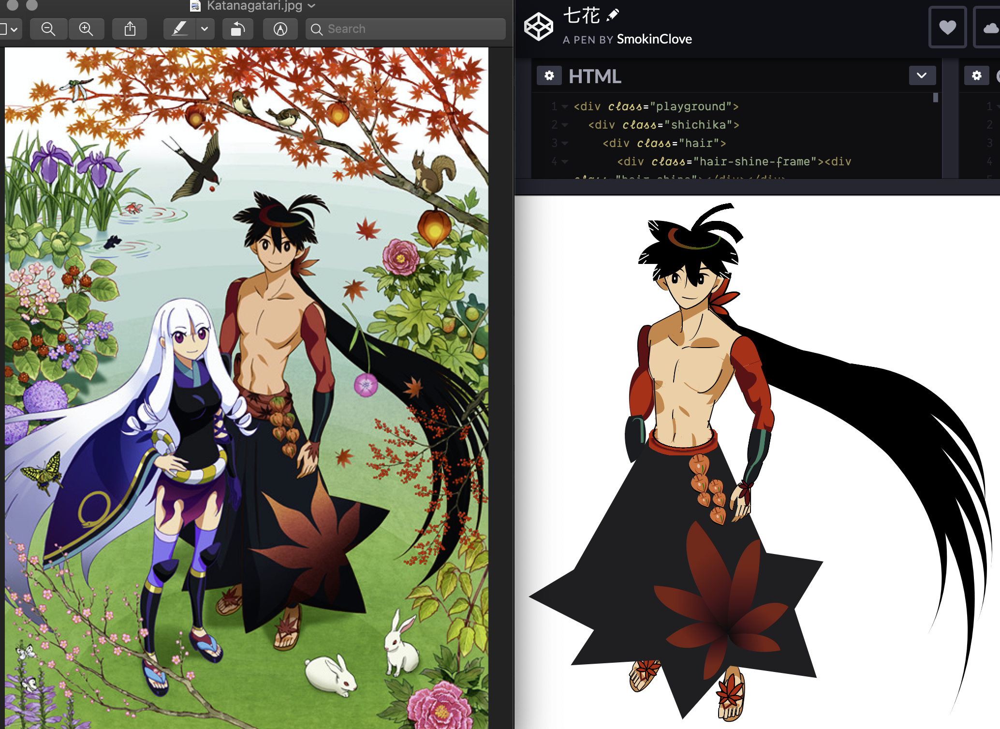

So, someone asked me on Twitter how i started drawing this portrait of Yosano Akiko as portrayed in the Japanese anime Bungou Stray Dogs.

Not that i am an expert at drawing with CSS, but just as with any other craft i had to try drawing quite a few pieces before being able to draw this one, starting with my most primitive knowledge of creating shapes with CSS to form a face (which was actually based on my own, more on that later).

Before any of the portraits began, i stumbled on this [pure CSS Francine](http://diana-adrianne.com/purecss-francine/) by Diana Smith some time at the beginning of 2019.

"CSS can do this?" was what crossed my mind.

This got me obsessed for as long as a few months. I kept pondering how i could achieve something similar. And the easiest way to figure that out is, flex our keyboard muscles and create something! Anything at all. Start simple. Draw a heart shape, then a pair of wings, then combine and make it a Cupid... If you would like some code snippets for some inspiration (i hope it does inspire) feel free to check out [my post on drawing a strawberry](https://smokinclove.github.io/writeups/drawing-a-strawberry-with-css-border-radius-and-gradient/)

Below is the timeline of the drawings i have created, all of which are done in CSS and HTML only - meaning no preprocessors like SASS or SCSS, and of course no use of javascript.

###1. February 2019-  [Self portrait attempt #1](https://codepen.io/SmokinClove/pen/ebbxRX)

I know, i know. Stop laughing, you.

Just kidding.

You can see that the elements used are very basic CSS tricks: the face and each of the glasses frames is a single div with uniform border radii, while the hair locks are div with single borders, a common trick to create triangles.

###2. March-May 2019 - [Tiny Dancer](https://smokinclove.github.io/moonwalker/)
I actually started this as an entry for the JSConf.Asia animations vying for a free ticket, but lost interest half way and went for a [kaleidoscope animation instead](https://codepen.io/SmokinClove/pen/gyOJKm). However i was asked if i wanted to demo something about React Hooks, and an opportunity presented itself. I like to call him Tiny Dancer - after the Elton John's song, as i wanted to theme the talk Hooks + Music.

As you can see, asthetically there is not much to it. Because the functionality is more important and because it would be a pain to make him into a beauty, i left him as a simple and hilarious dancer instead (sorry TD).

###3. May 2019 -  [Maple leaf](https://codepen.io/SmokinClove/pen/mojQqg) + [Snail](https://codepen.io/SmokinClove/pen/ZNYzbd) + [sunflower](https://codepen.io/SmokinClove/pen/NZNrRQ)

Some attempts to create real-life objects. The shell on the snail's back took me a real long time.

###4. July 2019 - [TalkCSS #41](https://singaporecss.github.io/41/) and [Kageyama Shigeo aka Mob](https://codepen.io/SmokinClove/pen/ZZZwgV)
Enter my first anime character portrait.

The story of drawing Mob dates back to a few months earlier shortly after i saw the Pure CSS Francine portrait and started to watch Mob Psycho 100. I thought, why don't i try to draw this guy? His design looks simple enough. I started on Mob shortly after my own self portrait, but left it sleeping for quite some time.

After attending JSCon Asia in June and aware that my senior at work Gao Wei has connections with organisers of TalkCSS (i did not realise she was a co-organiser for TalkCSS), i decided to give a talk about drawing Mob and anime characters in general as an excuse to finish up Mob's drawing - yes, i do seek out events as an excuse to go berserk quite frequently. I have never ever given a talk in front of total strangers who are out of school and in the industry. Compare to this, giving lessons as a Teaching Assistant in university was a different level of exposure because the content was already decided. The event saw around 20+ tech people with various levels of experience in the industry gathering together in the charming office of Rakuten Singapore, and needless to say i was scared sh*tless because my talk was not intended to be technical at all.

Although i had planned to not include any technical details in the talk, halfway through the preparation i stumbled upon [Fancy CSS Borders by 9elements](https://9elements.github.io/fancy-border-radius/) and immediately realised how much of a life saver this would be to me. Instantly i could figure out the parts of the Mob drawing that i was scratching my head over - eg his feet - and included this detail swiftly in the talk.

I included the snail and sunflower created separately before into the drawing for more comical effect, plus the sunflower appeared in the last anime ending in the second season of the show, and i liked it.

To my delight, the audience seemed to receive the talk well. Although no one probably was aware that i totally messed up my script, i received messages of encouragement from the audience afterwards and have also been recognised by a couple of people during other socialising events that i went to shortly after.

If you are interested, watch the recording of my talk [here](https://www.youtube.com/watch?v=j7bx3CTkq-E)

###5. July 2019 -  [Laughing crying emoji](https://codepen.io/SmokinClove/pen/OeQPje)

I wanted to experiment how i far i can go with this new treasure i found aka CSS Fancy Borders. The tears are a single div making use of this tool. This emoji was used for the slides during my TalkCSS talk.

###6. July 2019 - [Self portrait attempt #2](https://codepen.io/SmokinClove/pen/agqpaZ)

This was also first revealed during the TalkCSS event at the end because i thought it would create a good contrast with the first attempt. Thanks to the fact that my hairstyle was already influenced by anime, i just needed to add some anime touches on the eyes to make it consistent with the anime theme.

Then a miracle happened. I first noticed this particular drawing getting attention when i saw it among the picked pens on Codepen with my own eyes. I have no idea how the picked pens are selected so i assumed that those with over 100 views would likely end up there. But the view count for this one did not stop there. Within a day it went tenfold to a thousand and i had no idea what was going on because of all my codepens this one was the only one which ever got past 100 views. This was nothing short of miraculous because there was no sharing of direct link to the pen itself prior to this, unlike the Mob drawing.

My questions were partially answered when a new friend i made through TalkCS - the organiser herself, Chen Hui Jing - graciously notified me on Twitter of 2 websites where the drawing was featured. Aha! So that's what happened. At the time of this writing, the views have slowed down and now hover around 5k.

###7. July 2019 - [Yasuri Shichika](https://codepen.io/SmokinClove/pen/EBEYod)

This one is my pride. There are more challenging parts to this boy's official art but the parts that i am fond of the most are the little ring on his head and his left hand. Those are among the small parts that require working on minute details and i was very satisfied with the end result for those two. One of the things i realized while drawing this is that, the maple leaf as portrayed in Japanese art (which is different from the one i drew before that resembles the Canadian flag emblem) is very very hard to draw. There are a few variants to the Japanese maple leaves, but either the one in Shichika's skirt or the one in Chihayafuru (screenshot below) is too tricky for me to even start.

I do hope to be able to nail these 2 designs one day though, but taking into account how much time it would have taken, i decided to simplify it and finish the piece lest it is left for too long.

###8. July 2019 - Interlude: [A strawberry](https://codepen.io/SmokinClove/pen/EqYWKe)

This one is an experiment with writing a post describing the process of drawing. I gotta say, while it was okay to [talk about drawing a strawberry](https://smokinclove.github.io/writeups/drawing-a-strawberry-with-css-border-radius-and-gradient/), it would be hard to explain things such as the Yasuri Shichika full body portrait or the Yosano one below.

###9. July 2019 - [The crimson sunset](https://codepen.io/SmokinClove/pen/LYPLKvr)

As a break from drawing anime characters, and since i had just skimmed through the manga Chihayafuru (i only watched a few anime episodes enough for me to hear my idol Hosoya Yoshimasa voice Arata in a Fukui accent), a certain poem caught my attention. Ironically, this is the one poem, though recited a few times in the show, is not one of the 100 poems in the karuta game around which the show revolves.

I just love the image of a crimson sunset so much i improvised a scene with a love letter and an omamori, with the original Japanese text and my own English translation of the poem.

###10. August 2019 - [Anime eye](https://codepen.io/SmokinClove/pen/bXBXZr) and [Kuchiki Rukia](https://codepen.io/SmokinClove/pen/NQNRzo) (face only)

Improvised (i.e with no direct reference either with official arts or on paper) and subsequently used for an internal talk for [ReactKnowledgable in Shopee](https://twitter.com/reknowledgeable)

###11. August 2019 - [Hand](https://codepen.io/SmokinClove/pen/rXyYqM) and a [side profile of a girl](https://codepen.io/SmokinClove/pen/QevJxY)

Used for the same aforementioned internal talk. The side profile was deliberately chosen as a start for Yosano Akiko(below).

###12. August 2019 - [Yosano Akiko](https://codepen.io/SmokinClove/pen/VoEbME)

My third full bodied portrait. Developing upon the aforementioned side portrait of a girl, and adding the butterflies that fade, i decided to make the butterfly in front of her animated by using scaling animation on the wings. Of course it would be great if i could animate the fading butterflies as well but, that would be a lottt of effort.

Thoughts

One thing worth mentioning here is, when drawing something relatively complicated, i have figured i prefer using absolute position and block display instead of using flex. For example, even though the human body can be viewed as a vertical flex parent container consisting the head, the body and legs, i would still prefer to have each of these 3 an absolutely positioned block and then translate the body and the legs downwards. There are certain times where flex or grid display is actually plausible - i draw the snail's front part using grid - but i settled with just block and absolute positioning so that i have more control over where to move the components. If a group of components should be moved or transformed together, i would wrap them in a separate absolute block and transform the whole group together. For this Yosano portrait, because i am not confident in my own sense of ratio, i made the whole head a block and experiment with different scales and rotation to find out the position and size that looked proper.

Also, i have a habit of drawing out the things that i do not have a direct copy to refer to. I am not a designer or digital artist, therefore my only sketching medium is pen and paper.

Below is an example of the paper sketch, to compare with the CSS version for the Yosano portrait.

On the other hand, Shichika's portrait was modeled directly after an official art so i had a copy to stick to. Either way, it will not be 100% similar to the source, but having this planning stage helped a little with the ratio and of course the initial decision of which parts group with what.

Also, start with small parts before combining into a big piece. For Yosano, i drew the butterfly separately and combined into the main Yosano pen. Similarly, i drew the maple leaf separately before merging into Shichika's pen.

Last but not least, i figured i should try to finish anything that's started within 2 weeks from the starting date because, as the piece is left too long, the momentum will be lost.

###13. Honorable mentions

Why a 13th section? Maybe because i like the number 13. Maybe because it is prime. Maybe.
But i also would like to add these 3 even though they are not anime characters.
Those are done for other people: [the first](https://codepen.io/SmokinClove/pen/OqJKEw) for my mentor when he left the company, [the second](https://codepen.io/SmokinClove/pen/ZdarRZ) for my senior's birthday and [the last](https://codepen.io/SmokinClove/pen/GRKNemo) for my boss' wedding which i could not attend.

The sketch and CSS version for the last drawing

###Conclusion
I wouldn't say i achieved something of Diana Smith's level with Pure CSS Francine, but being only half a year into this adventure, i am sure there are a lot more things i could learn and still a lot more i can make from the things i learn.

To more CSS art,

~Cherrio~