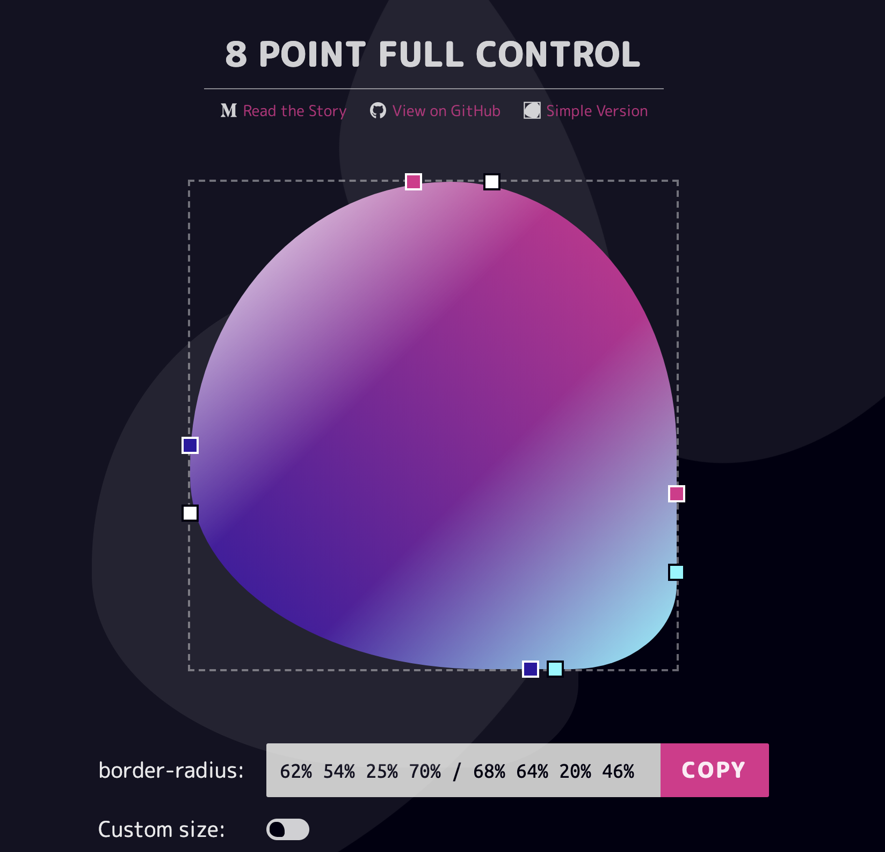
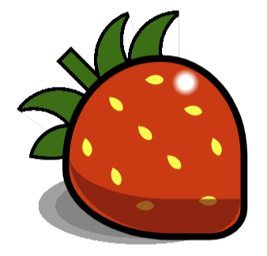
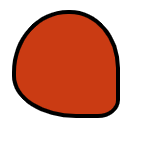
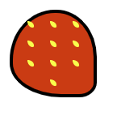
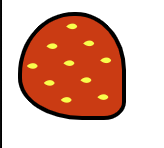
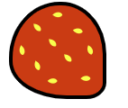
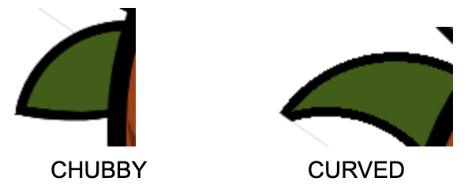
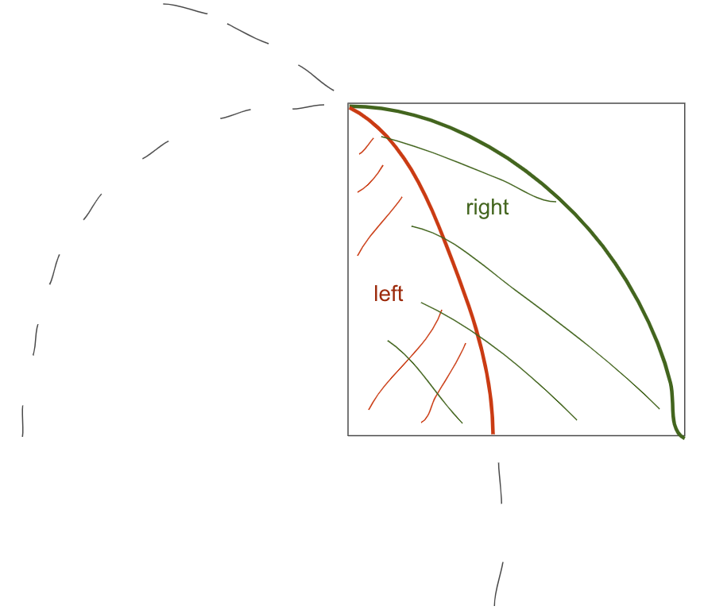

Hi there, ever wondered about what would be like drawing a fruit in CSS?

I was playing around with 9elements' Fancy Border Radius at https://9elements.github.io/fancy-border-radius a lot lately and one day i got an interesting shape...

It looks like this....


and i thought it looks like...
A strawberry!


So here we are, having this post thanks to this very handy tool that allows us to visualize various shapes possible just with border-radius.

BTW there is a full control version when you can control all 8 points. https://9elements.github.io/fancy-border-radius/full-control.html

If you have not read their Medium post, please do. The link is in the website but here it is https://medium.com/9elements/css-border-radius-can-do-that-d46df1d013ae

###The end goal

The aim of this post is to make something like this...


###TL:DR aka just show me the damn code
https://codepen.io/SmokinClove/pen/EqYWKe

### In case you stayed

Let's dive in!

So first of all let us create a div with the class name ... yeah, "strawberry"


```
  <div class="strawberry"></div>
```


As for CSS, i like to use absolute positioning because it makes it easier to shift elements without affecting other. So for the strawberry, we can let is be relative first so its children can be absolute.

```
  .strawberry {
    position: relative;
    width: 50px;
    height: 50px;
    background: red;
  }
```

Use the preset border radius below to preview the shape https://9elements.github.io/fancy-border-radius/full-control.html#68.62.64.70-54.46.80.75-.


So now our strawberry CSS will look like this

CSS
```
.strawberry {
  position: relative;
  border-radius: 62% 54% 24% 70% / 68% 64% 20% 46%;
  border: 2px solid black;
  width: 50px;
  height: 50px;
  background: red;
}
```
Next, i would want to draw some seeds on the surface of the strawberry, so let us give the strawberry display flex and centralized contents
```
.strawberry {
  position: relative;
  border-radius: 62% 54% 24% 70% / 68% 64% 20% 46%;
  border: 2px solid black;
  width: 50px;
  height: 50px;
  background: red;
  display: flex;
  justify-content: center;
  align-items: center;
}
```
By this time our strawberry should look like this


And because i want to have 3 rows of 3 seeds each plus one last row with only one seed, i added into the html as below
```
 <div class="strawberry">
    <div class="seeds">
      <div class="row row-1">
        <div class="seed"></div>
        <div class="seed"></div>
        <div class="seed"></div>
      </div>
      <div class="row row-2">
        <div class="seed"></div>
        <div class="seed"></div>
        <div class="seed"></div>
      </div>
      <div class="row row-3">
        <div class="seed"></div>
        <div class="seed"></div>
        <div class="seed"></div>
      </div>
      <div class="row"><div class="seed"></div></div>
    </div>
  </div>
```

Right now nothing will show up yet because we haven't added any css to the seeds.

Let us talk about the seeds for a moment. Usually the seed is not a square, not a circle, but more like a teardop shape.

Can we do it with border-radius?

Of course, feel free to to back to the Fancy border radius and play with it! Or you can use the preset here to preview.
https://9elements.github.io/fancy-border-radius/full-control.html#0.0.77.80-0.0.79.81-.

Let us go ahead and add a few CSS styles for the seeds.

```
.seed {
  width: 4px;
  height: 4px;
  background: yellow;
  margin: 4px 5px;
  border-radius: 0% 100% 19% 80% / 0% 77% 21% 100%;
}
```

Oops! All the seeds are lined up in a straight line. Since i want 3 rows, each of the rows should be of horizontal arrangement. For that i will give them flex display.

```
.row {
  display: flex;
  justify-content: center;
}
```

We're getting there! ;)


Now, because of the way we used the border radius, the strawberry tilts about 45 degree anticlock wise. So I want to turn the whole 4 rows of seeds in the same direction too for easier alignment. Let's add this CSS into our stylesheet.

```
.seeds {
  display: flex;
  flex-direction: column;
  padding-top: 8px;
  transform: rotate(-45deg);
  justify-content: center;
}
```
Now the seeds should look better contained within the strawberry.



Next is aligning the seeds. Actually i think there is no fixed rule to this. As for me i like to shift the center seeds of the first 3 rows up a bit while tilt the outer seeds inwards for each row.

So my CSS would look like this.

```
.row-1 div:nth-of-type(1) {
  transform: rotate(80deg);
}
.row-2 div:nth-of-type(1) {
  transform: rotate(70deg);
}
.row-2 div:nth-of-type(3) {
  transform: rotate(10deg) translate(2px,2px);
}
.row-3 div:nth-of-type(3) {
  transform: rotate(70deg) translate(2px,2px);
}
.row div:nth-of-type(2){
  transform: translate(1px,-3px) rotate(45deg);
}
```

Tada!



Now, here comes the more fun and possibly more challenging (?) part  - the leaves. First let us make a simple chubby leaf (the leftmost one in the first screenshot). Go ahead and add a new div right under the `seeds` div

```
  <div class="strawberry">
    <div class="seeds">
      <!-- The seeds code ... -->
    </div>
    <div class="leaf-1 leaf"></div>
```

To make this chubby face, again we can use the single border radius property. Go and play around with the tool again.

In case you need a tamplate, use this to preview https://9elements.github.io/fancy-border-radius/full-control.html#0.0.100.28-0.0.100.100-.

and the CSS:

```
.leaf-1 {
  position: absolute;
  left: 0;
  width: 10px;
  height: 10px;
  border-radius: 0% 100% 0% 28% / 0% 100% 0% 100% ;
  border: 1px solid black;
  transform: rotate(-80deg) translate(0px,-13px);
  background: green;
}
```

Now this leaf looks cute and all but, what if i want a curved one instead of chubby one?



As it looks, the border radius does not seem to allow us such a concaved background. There are sure to be multiple ways to achieve this. Maybe we could divide the leaf into multiple divs and stack them up while rotating the parts progressively.

In this post i will use stacking 2 circles on top of each other using radial-gradient.

We will have one quarter of a circle as the base, with background green, and one arc on the left with background white to cover up the green at the bottom.

For lack of more creative words i will name the 2 parts `left` and `right`:



```
  <div class="strawberry">
    <div class="seeds">
      <!-- The seeds code ... -->
    </div>
    <div class="leaf-1 leaf"></div>
    <div class="leaf-2 leaf"> 
      <div class="right"></div>
      <div class="left"></div>
    </div>
  </div>
```
And let us then add the CSS :D

```
.leaf.leaf-2 {
  position: absolute;
  left: 0;
  top: -15px; /* because the height of the leaf is 15px, shifting it up 15px here to make it easier to see */
  width: 15px;
  height: 15px;
  transform: rotate(-55deg) translate(-23px, 1px);
  z-index: -2;
}
.leaf-2 .left {
  position: absolute;
  width: 100%;
  height: 100%;
  background: radial-gradient(circle at -54% 78%, white 50%, black 50% calc(50% + 1px), transparent calc(50% + 1px));
}
.leaf-2 .right {
  position: absolute;
  left: 0;
  bottom: 0;
  width: 100%;
  height: 100%;
  background: radial-gradient(circle at 0 100%, green 0 14px, black 14px 15px, transparent 15px);
}
```

Yay! we've got a curved leaf and a chubby leaf!

Well as for the other 2 leaves, i just flipped the curved leaf around and translate them to my desired position 🌚

So i can copy the second leaf's HTML and CSS code and customize their styles further.

HTML:
```
  <div class="strawberry">
    <div class="seeds">
      <!-- The seeds code ... -->
    </div>
    <div class="leaf-1 leaf"></div>
    <div class="leaf-2 leaf"> 
      <div class="right"></div>
      <div class="left"></div>
    </div>
    <div class="leaf leaf-3 leaf-2">
      <div class="right"></div>
      <div class="left"></div>
    </div>
    <div class="leaf leaf-4 leaf-2">
      <div class="right"></div>
      <div class="left"></div>
    </div>
  </div>
```

CSS:
```
.leaf.leaf-3 {
  transform: scaleX(-1) rotate(20deg) translate(-4px, 4px);
}
.leaf.leaf-4 {
  transform: scaleX(-1) translate(-17px, 0px);
}
```
And the most tedious part is over! For the inner shadow, the stalk, outer shadow and the white shining part, i leave the reader to explore :D The inner shadow was quite a cheating implementation because i just copied the strawberry skin and add color to the border radius. If you are pickier than me about shadows, feel free to polish yours and share them with me :D

See the whole code so far:
<iframe height="265" style="width: 100%;" scrolling="no" title="Strawberry with border radius and radial gradient" src="//codepen.io/SmokinClove/embed/jgPKwL/?height=265&theme-id=dark&default-tab=css,result" frameborder="no" allowtransparency="true" allowfullscreen="true">
  See the Pen <a href='https://codepen.io/SmokinClove/pen/jgPKwL/'>Strawberry with border radius and radial gradient</a> by SmokinClove
  (<a href='https://codepen.io/SmokinClove'>@SmokinClove</a>) on <a href='https://codepen.io'>CodePen</a>.
</iframe>

My complete code can be found here https://codepen.io/SmokinClove/pen/EqYWKe

Cheerio!